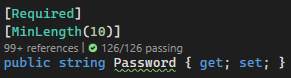
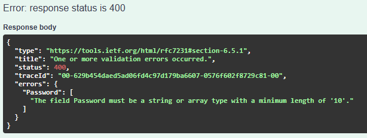
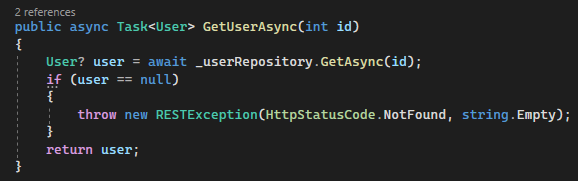
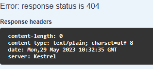

# Software Guidebook

Welcome to the D-Lama software guidebook! D-Lama is a powerful application designed to label your data efficiently and qualitatively with ease. Whether you are a business owner, researcher, or student, D-Lama offers a wide range of features to help you label, access, and validate your data. This guidebook will walk you through the installation process, technical decisions, explain how to use the various features of D-Lama, and provide helpful tips and tricks to help you get the most out of the software. We hope this guidebook will serve as a valuable resource as you explore the capabilities of D-Lama and use it to include your data in your machine learning lifecycle.

## 1. Context

D-Lama is a tool that lets you upload data, which has to be labled or label datasets in a playful way, so the important labeling process has an advantage for everyone involved.

The main use cases of this tool are:
1. Labeling Data from chosen datasets
2. Upload and administrate your datasets
3. Extract your data via modern API

### Users
There are two types of users in D-Lama
1. The "administrator" who uploads data and checks the quality
2. The "labeler" who wants to label data for exciting projects

## 2. Functional overview

The main sequence of the D-LAMA web app is defined for two user perspectives:

### Administrator view
1.	Admin user opens D-LAMA web app and logs in with their admin account credentials.
2.	After logging in, the admin user is directed to the admin dashboard where they can view a list of their labeling projects.
3.	The admin user selects the option to create a new labeling project.
4.	The app prompts the admin user to enter name and description for the new project, as well as upload the dataset to be labeled.
5.	The admin user also defines the labels or categories for the dataset that the user will be able to choose from when labeling.
6.	After creating the project, the admin user is directed to the project page, where they can see the progress of the labeling process as the data labelers are applying them.
7.	The admin user can view individual data points in the dataset and see the tags that have been applied to them, as well as update or add new labels as necessary.
8.	If the admin user notices any issues with the labeling process, they can adjust specific data points as needed.
9.	As the labeling process progresses, the admin user can view the overall progress of the project and see how many data points have been labeled, how many are remaining, and the overall accuracy of the labels applied.
10.	Once all data points have been labeled, the admin user can download the  dataset for use in machine learning models or archive the project if it is no longer needed.

### Data labeler view
1.	User opens D-LAMA web app and is prompted to log in with their account credentials.
2.	After logging in, the user is directed to their dashboard where they can view a list of labeling projects.
3.	The user selects a specific labeling project from the list to start working on.
4.	The selected project opens and displays the first data point.
5.	The user swipes up, down, left, or right to label the data point, or skips it if unsure.
6.	The app automatically loads the next data point in the sequence, and the user repeats step 5 until the whole dataset is labled.
7.	When the user finishes labeling all datasets in the project, they are directed back to their dashboard and can view their progress on the project.
8.	The user can select another project from their dashboard and start a new labeling process.

### Additional functions of the prototype
The D-LAMA web app should additionally fulfill the following requirements already in the prototype:
- The data labeler can interrupt or pause the process and resume it at a later time.
- The data labeler can add and remove labeling projects.
- Both a Data Labeler and an Admin can register an account and log in.
- An administrator of a project can set the datatype of the dataset as text or image.

The following extensions can be added in later iterations:
- An administrator or creator of a data label project should be able to set the data type of the data set as video and audio.

## 3. Quality attributes

D-Lama has been designed with a focus on several key quality attributes, including:

### Usability
D-Lama has been designed with usability in mind, making it easy to use and understand for all kinds of users. The software includes very intuitive and common swipe mechanisms in its interface which will ease the labelling process. Additionally D-Lama is built in a modern mobile first approach to guarantee the management of data anytime everywhere.

### Scalability
D-Lama has been designed to be scalable. A docker image is built and will be published on a kubernetes cluster, where scalability is key. If there is more traffic or there is an ask for self hosted instances, there is an easy way to achieve it.

### Performance
Because of possible large datasets thought went into performance. With clever loading and paging mechanisms and a lean code D-Lama will place strong emphasis on performance.

## 4. Constraints
A number of constraints have influenced the development of D-Lama:

### Budget
Without any money the only available ressources are time and know-how of the developers. This is limited and is calculated as follows:

$$NumberOfECTS * TimePerECTS * NumberOfDevelopers$$

$$where$$

$$NumberOfECTS = 4$$

$$TimePerECTS = 30h$$

$$NumberOfDevelopers = 8$$

$$= 4 * 30 * 8  = 960h$$

### Know-How
The development team is mixed with different knw-how-levels. Because of the fact everyone is a computer science student the foundations of developing is given. Handling new technologies and different aspects of software development and management is for sure a challange which needs to be mentioned. Lots of things are learning by doing and therefore take longer than usual.

## 5. Principles

### Best Practice
Software development best practices can vary depending on the context and specific requirements of a project, but some common practices that are generally considered to be beneficial include:

* Following an Agile methodology for flexible and iterative development
* Implementing Continuous Integration and Delivery for efficient and reliable software releases
* Writing clean and maintainable code using best coding practices and principles like SOLID and DRY
* Ensure requirements and qaulity thorough testing
* Collaborating effectively across teams and communicating clearly and frequently with clients.

### Agile Development
Agile development is a software development methodology that emphasizes flexibility, collaboration, and rapid iteration. It emphasizes continuous feedback and the ability to respond quickly to changes in requirements. As an agile team we work in short, focused sprints to deliver incremental improvements to the software.

### Kanban
Kanban is a visual project management framework that helps teams manage workflow and increase efficiency. It is based on the principles of just-in-time manufacturing, limiting work in progress, and optimizing flow. Kanban boards typically use cards or sticky notes to represent work items, we use the Github Issueboard organized into columns that represent the stages of the workflow. Every Kanban iteration is three weeks long.

### SOLID
SOLID is an acronym that stands for five principles of object-oriented programming and design. Here are the explanations for each point of SOLID:

1. **S**ingle Responsibility Principle (SRP): A class should have only one reason to change. This means that a class should have only one responsibility or job to perform, and it should not be responsible for more than one thing.

2. **O**pen-Closed Principle (OCP): A class should be open for extension but closed for modification. This means that a class should be designed in a way that it can be extended or modified without changing its existing behavior or implementation.

3. **L**iskov Substitution Principle (LSP): Subtypes should be substitutable for their base types. This means that a subclass should be able to be used in place of its superclass without causing any errors or unexpected behavior.

4. **I**nterface Segregation Principle (ISP): Clients should not be forced to depend on interfaces they do not use. This means that interfaces should be designed in a way that clients only depend on the methods they need and do not have to implement methods they do not need.

5. **D**ependency Inversion Principle (DIP): High-level modules should not depend on low-level modules. Both should depend on abstractions. Abstractions should not depend on details. Details should depend on abstractions. This means that the design should depend on abstractions instead of specific implementations, and it should be easy to change the implementation without affecting the rest of the system.

### Continous Integration
Continuous Integration (CI) is a software development practice that involves merging code changes from multiple developers into a shared code repository multiple times a day. This allows teams to catch integration errors and conflicts early on and fix them quickly. CI also involves running automated tests and builds to ensure that the code is functional and meets the project's requirements.

### Continous Delivery
Continuous Delivery (CD) is a software development practice that involves automating the entire software release process so that code changes can be reliably and frequently released to production. This involves building, testing, and deploying code changes in a fast and automated way, with the goal of reducing time to market, increasing efficiency, and improving the quality of the software. CD is often associated with Agile and DevOps methodologies and relies heavily on automation and collaboration across teams.

### Contribution Guidelines
  <ul>
    <li>Pick an issue you'd like to tackle and assign it to you.</li>
    <li>Create a new branch from main to work on the issue with it's correct tag (e.g. feat/issue_1).</li>
    <li>If one issue depends from another issue take that branch as base (dependent issues can happen, should be avoided at all costs).</li>
    <li>Prefix every commit you are making as suggested in <a href="https://github.com/semantic-release/semantic-release#how-does-it-work">semantic release</a> and add a meaningful description.</li>
    <li>Check the coding guidelines (link follows) for a clean and maintainable code</li>
    <li>If you have solved the issue, let it review from min. one other person.</li>
    <li>As a reviewer, make sure you point out what was good, what was bad and how you'd do it differently. Also make sure you take time for a review, because they are very important for consistency and maintainability.</li>
  </ul>

## 6. Software Architecture
<a href="/tech/c4model/readme.md">Diagrams</a>

## 7. External Interfaces

No external interfaces or APIs are used for the moment.

## 8. Code
### Github organization
D-LAMA consists of multiple GitHub repositories, each containing code or documentation for different aspects of the application:

d-lama-webapp: This is the front-end of the D-LAMA application. It uses the JavaScript framework React and the component library Ionic for UI development​​.

d-lama-service: This is the backend for the D-Lama application. It uses the .NET Core framework​.

ops-d-lama-service: This repository contains Continuous Integration/Continuous Deployment configurations​ for GitHub Actions and Kubernetes.

.github: Here you can find the documentation for the D-LAMA project.

### Backend
#### Middleware
The backend makes extensive use of middleware to extract logic from the controller and remove code duplication. We used mostly 4 different middlewares, which we will discuss here in more detail.
1. Model Validation (from .NET Core)
2. Authorize (from .NET Core)
3. AdminAuthorize
4. RESTExceptionFilter

##### Model Validation
This filter validates the model which is sent on a request. It is a middleware provided by entity framework core, which is enabled by default. It allowed us to specify validation rules on the model properties and would automatically return a BadRequest message to the user, if the model validation fails.

**Example:**

Model:

Request and response:

##### Authorize
With the defaulf .net core authentication and authorization middleware, we can easily define who should be able to access a specific endpoint.
Using the **[Authorize]** attribute will automatically check, if the user has provided a valid JWT-Token.

##### AdminAuthorize
This middleware was written by us and will extend the [Authorize] attribute by also checking if the user is registered as an administrator.
Instead of using **[Authorize]** you can just specify **[AdminAuthorize]** in order to secure and endpoint only for admins.

##### RESTExceptionFilter
Lastly, one of our own written middleware is the **RESTExceptionFilter**. As this is an exception filter, it only gets executed, when an exception occurs.
It then checks if the exception is of the type RESTException and if so, it will automatically return the result depending on the provided type.

This middleware allows us to throw exceptions within the domain logic and return automatically an REST-response.

**Example:**

For example, the UserService class cannot find the requested user. Then it can just throw a RESTException:

Which will then be handled by the RESTExceptionFilter class, which will return an 404 NotFound result to the client:

This makes our controllers a lot slimmer, as we can just use the middleware to determine the error responses instead of always making a try and catch within the controller method.

## 9. Data

## 10. Infrastructure Architecture
D-Lama is hosted on a Rancher Kubernetes cluster at ZHAW on-premise. It provides scalability and high availability. The architecture consists of the following components:

1. Deployment for the d-lama-service, the MSSQL deployment, and the d-lama-webapp.
2. Service for the d-lama-service, the MSSQL deployment, and the d-lama-webapp.
3. Pod for the d-lama-service, the MSSQL deployment, and the d-lama-webapp.
4. Ingress rule for the d-lama-service and the d-lama-webapp.
5. Persistent volume claim for the MSSQL deployment.
6. Secrets for the MSSQL deployment.

## 11. Deployment
D-Lama's deployment process is managed through a Continuous Integration/Continuous Delivery (CI/CD) pipeline (GitHub Actions), automating the steps from code change to deployment in production:

The deployment process begins when developers commit changes to their respective branches. Once the changes are verified, they are merged into the main branch. Each commit triggers a Continuous Integration (CI) process that builds, tests, and performs a semantic release. The Continuous Delivery (CD) process is more selective. It is only activated when a commit is pushed to the master branch with a specific prefix in the commit message. This CD process then builds a Docker image and deploys it to the Kubernetes cluster. This approach ensures that only tested and validated changes are deployed.

## 12. Operation and Support
The Rancher Kubernetes cluster that hosts D-Lama is monitored by the ZHAW, while the D-Lama system itself is observed by its own team. Should issues occur, the DevOps team provides support to resolve them. This approach to monitoring ensures the smooth operation of the D-Lama service.

## 13. Decision Log
Decisions were made during Retrospectives and weekly meetings for D-Lama's development. These decisions and the individuals responsible for each task were documented and can be found in the weekly and retrospective notes in the .github repository. This log allows tracking the history and progress of the project.

  
<h3>Use Markdown any decision records</h3>

  We decided on using markdown any decision records because it fits with our documentation, is easy to implement and looks pretty.
  

  <a href="/tech/adr/0000-use-markdown-any-decision-records.md">Read more</a>
  

  
<h3>Develop backend and fronend separately</h3>

  We have decided to develop the backend and frontend separately for the webapp D-LAMA.
  

  <a href="/tech/adr/0001-develop-frontend-and-backend-separately.md">Read more</a>
  

  
<h3>Use ASP.NET Core</h3>

  We have decided to use ASP.NET Core for creating the backend of D-LAMA
  

  <a href="/tech/adr/0002-use-asp-net-core.md">Read more</a>
  

  
<h3>Implement Repository and Unit of Work Patterns</h3>

  We have decided to implement the Repository and Unit of Work Patterns in the backend of D-LAMA. 
  

  <a href="/tech/adr/0003-implement-repository_and_unit_of_work_patterns.md">Read more</a>
  

  
<h3>Implement REST API</h3>

  We have decided to implement a REST API for the webapp D-LAMA
  

  <a href="/tech/adr/0004-implement-rest-api.md">Read more</a>
  

  
<h3>Use REACT as Frontend Library</h3>

  We have decided to use React as frontend library.
  

  <a href="/tech/adr/0005-use-REACT-as-frontend-library.md">Read more</a>
  

  
<h3>Use IONIC as Frontend Framework
</h3>

  We have decided to use React as additional component library.
  

  <a href="/tech/adr/0006-use-IONIC-as-frontend-framework.md">Read more</a>
  

  
<h3>Use vite as tooling library and vitest as their unit test framework
</h3>

  We have decided to use vite as tooling library to execute runners and vitest as unit test framework.
  In addition, the end-to-end testing framework cypress was used for automated integration testing
  

  <a href="/tech/adr/0007-us-vitest-as-unit-test-framework.md">Read more</a>
  

(Hier ADR files verlinken)
